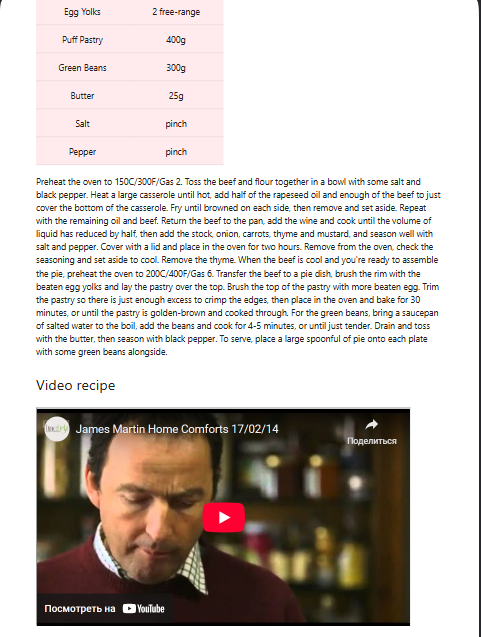

<h1 align="center">React-food or React shopMeals</h1>

## Description

This project has written using React functional components. Implemented a search for dishes by category such as meat, chicken, dessert and a search by recipe area such as Canadinan, Japanes.

## About the project.
- The markup is implemented using the front-end framework Materialize (https://materializecss.com).
- The markup is drawn dynamically using React functional components.
- The transition between the pages of the site is implemented using SPA routing.
- The meals data for this project is obtained from an open database https://themealdb.com/api.php. Requesting data using "async await".

## Adaptive design

The interface design is provided for various types of devices.

## **Desktop**

## **Mobile**

## **Seach by Category and Area**

Each page has a go back button that takes the user back to the previous page.
The search bar shows the path to the page where the user is located.

## **Сategory section**

## **Recipe section**

## **The result of going to the wrong address**

## I invite you to see my other projects.
